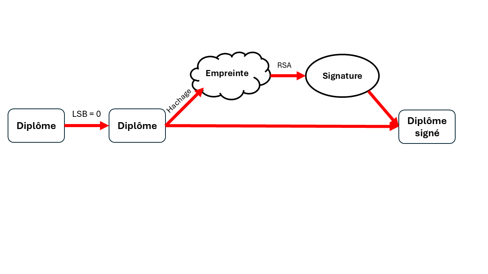
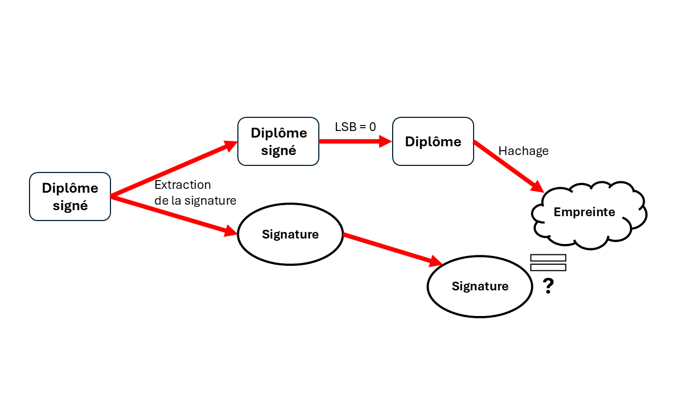

# Présentation d'un prototype pour la génération de diplômes numériques sécurisés
*Gor GRIGORYAN* 

*Julien GALERNE*

## Problématique
Afin de créer des versions numérique de diplôme infalsifiables, nous avons développer un petit prototype répondant à cette problématique.

Un diplôme contient un certain nombre d'informations qui, combinées ensemble, le rendent unique. En effet, il est inscrit le nom et prénom de l'étudiant, sa moyenne et sa date de naissance. Autant de données à caractères personnel qui peuvent être reliées à une seule personne.

Cependant, puisque ces diplômes sont au format numérique (image), ils pourraient être modifiés avec un logiciel d'édition d'image afin de changer la moyenne de l'étudiant par exemple.

C'est pourquoi nous vous proposons la solution suivante.

## Solution
Pour répondre à cette problématique, nous générons d'abord le diplôme en bonne et due forme. Les informations de l'étudiant sont incrites sur le diplôme à savoir :
- son nom
- sa moyenne (et sa mention)
- sa date de naissance

Les autres informations présentes sur le diplôme sont :
- le nom de l'université
- le nom du diplôme
- la session

Tout cela est écrit en clair sur le diplôme et rend la combinaison de toutes ces informations le rendent unique.
*Les bits de poids faible de l'image sont mis à zéro, ce qui nous servira plus tard.*

Ensuite, le diplôme est haché avec un algorithme de hachage. Cela génère une empreinte pour notre image qui est à son tour signée à l'aide d'un algorithme de cryptographie asymétrique.
La clé privée est connue seulement par l'université alors que la clé publique est disponible pour tout le monde.

Nous obtenons donc une signature unique pour notre diplôme.

Celle-ci est ensuite cachée dans le diplôme. Pour cela, on met à zéro les bits de poids faible de l'image, ce qui nous permet d'utiliser ces bits pour cacher notre signature.
C'est cette version du diplôme, avec la signature cachée, qui est ensuite envoyée à l'étudiant.

Maintenant, pour vérifier l'authenticité du diplôme, il faut extraire la signature cachée dans le diplôme.
Ensuite, les bits de poids faible sont remis à zéro et l'image du diplôme est hachée à nouveau.
Enfin, la signature extraite est comparée avec la nouvelle empreinte de l'image en utilisant le clé publique.

**Si le moindre pixel de cette image a été modifié, la nouvelle empreinte de l'image ne coincidera pas avec la signature extraite et le diplôme perdra son authenticité.**

### Génération du diplôme

### Vérification du diplôme

## Choix techniques
Pour réaliser ce prototype, nous avons utilisé le langage de programmation Python. Il contient de nombreuses bibliothèques utiles pour la cryptographie et la manipulation d'images. De plus, il est possible de faire tourner cette solution sur un serveur avec un framework de développement web tel que Flask.

Afin de généner le diplôme, nous utilisons la bibliothèque de manipulation d'image `Pillow`.

Pour cacher et récupérer des informations dans une image, nous utilisons les librairies `numpy` et `himage`.

L'algorithme de hachage utilisé est SHA-256 et la signature est générée à l'aide de l'algorithme de cryptographie asymétrique RSA.
Tout cela est disponible dans la bibliothèque `pycryptodome`.

Tout cela permet donc de faire tourner notre prototype sur un serveur Flask de l'université, où l'utilisateur enverrait l'image sur ce serveur ainsi que la clé publique afin de vérifier l'authenticité du diplôme.

## Conclusion
En conclusion, on a ici une manière simple et efficace d'authentifier notre diplôme. La modification du moindre pixel de cette image entrainera la génération d'une empreinte totalement différente, rendant la signature invalide lors de la vérification.

Pour mettre en place ce service, il est raisonnable de pouvoir mettre en place un serveur web Flask, avec une route qui dirige l'utilisateur vers un formulaire. Sur celui-ci, on téléverse notre copie numérique du diplôme et le serveur nous dit si le fichier est authentique ou non.